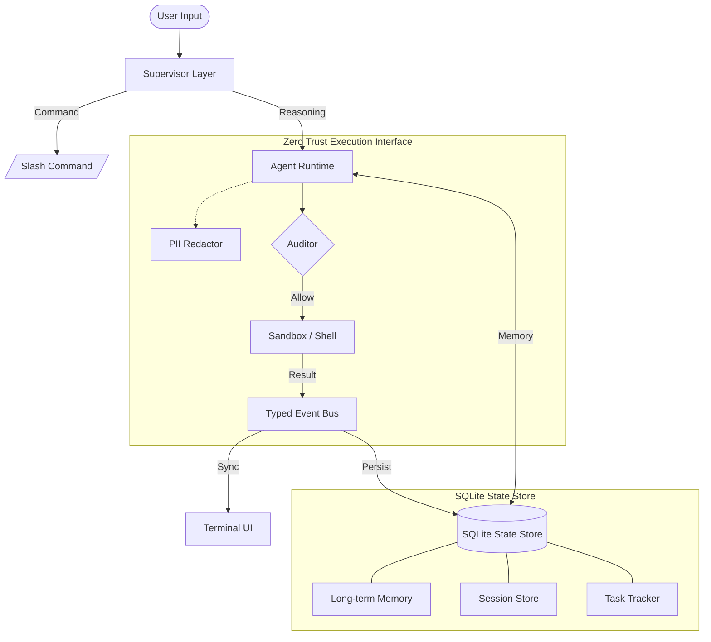

# Obsidian Next


[](LICENSE)
[](package.json)
[](CHANGELOG.md)
[](tsconfig.json)

**Obsidian Next** is a strict, structure-driven AI engineering runtime designed for high-assurance agent workflows.

Unlike conversational coding assistants that rely on unpredictable text streams, Obsidian Next operates on a **Deterministic Event Bus**, enabling precise state synchronization, rigorous permission enforcement, and "Zero Trust" execution for sensitive engineering environments.

---

## Core Architecture

Obsidian implements a **Supervisor-Agent Topology** where all actions are pre-flight validated by an Auditor compliance layer before affecting the host system.



---

## Key Features

### Zero Trust Security
- **Runtime Auditor**: Every file access and shell command is statically analyzed for safety violations before execution.
- **PII Redaction**: Real-time sanitation of sensitive data (API keys, credentials, PII) from LLM context windows.
- **Secure Storage**: System Keychain integration for credential management; minimal disk footprint.

### 100x Context Architecture
- **High-Fidelity Tracking**: 10x10 visualization grid (`⛁`) providing precise, token-level insight into context window usage.
- **Semantic Summarization**: Intelligently compresses "middle" history using cheaper models (Haiku) to retain unlimited effective memory.
- **Resume 2.0**: Full session state restoration, preserving execution history, costs, and working memory across restarts.

### Long-term Memory (The Handoff)
- **Cross-Session Awareness**: Implicitly learns user preferences and project facts to eliminate redundant discovery questions.
- **Semantic Search**: Instant recall of decisions and patterns via vector-like search within a local SQLite vector store.
- **Personalized System Prompt**: Dynamically injects relevant memories into every agent interaction for deep domain adaptation.

### Structure-First Engineering
- **Typed Communication**: Agents communicate via structured JSON schemas, not raw text, preventing "hallucinated" tool calls.
- **Local-First**: All session state, memories, tasks, and usage metrics are maintained locally in a centralized **SQLite Database** (`.obsidian/state.db`).
- **Audit Logging**: Comprehensive, immutable logs of every agent decision and tool result.

---

## Installation

Install globally via npm to access the `obsidian` binary:

```bash
npm install -g @aurora-foundation/obsidian-next
```

## Quick Start

Initialize your environment. This interactive wizard handles PII-redacted credential entry and local configuration.

```bash
obsidian
/init
```

> **Note**: For security-critical networks, we recommend reviewing the [Sandboxing Guide](docs/SANDBOX.md) to configure OS-level isolation.

---

## Documentation Index

| Resource | Description |
|----------|-------------|
| **[Documentation Index](docs/INDEX.md)** | Navigation hub for all documentation, guides, and specifications. |
| **[Architecture Deep Dive](docs/ARCHITECTURE.md)** | Internals of the Supervisor, Event Bus, and Agent loop. |
| **[CLI Design System](docs/CLI_DESIGN_SYSTEM.md)** | UI specifications, component reference, and visual standards. |
| **[Tooling Reference](docs/TOOLS.md)** | API documentation for built-in tools (`bash`, `edit`, `read`, etc.). |
| **[Sandboxing Guide](docs/SANDBOX.md)** | Configuring `sandbox-exec` (macOS) and `firejail` (Linux). |
| **[Product Specs (PRD)](docs/PRD.md)** | Functional requirements, roadmap alignment, and features. |

---

## Future Roadmap

We are actively creating the next generation of autonomous engineering capabilities.

| Feature | Status | Description |
|---------|--------|-------------|
| **Adaptive Skills** (`/skills`) | In Dev | Dynamic loading of specialized domain capabilities (e.g., *Kubernetes Operator*, *React Performance Expert*) that inject context-specific rules and tools. |
| **Advanced MCP** (`/mcp`) | In Dev | Full Model Context Protocol service mesh for auto-discovering and connecting to local tool servers and databases. |
| **Computer Use** | Saved | Native GUI interaction capabilities allowing the agent to "see" and control desktop applications for end-to-end regression testing. |
| **Enterprise Comms** | Saved | Integration with Email (SMTP/IMAP) and SMS (Twilio) gateways for automated reporting and human-in-the-loop verification. |

---

## Contributing

We enforce professional engineering standards for all contributions:
1.  **Conventional Commits**: All PRs must follow the structured commit message specification.
2.  **Branch Convention**: Use `user-type/description` (e.g., `polyoxy-feat/context-grid`).
3.  **Verification**: All unit and integration tests must pass before review.

See **[CONTRIBUTING.md](CONTRIBUTING.md)** for detailed workflows.

## License

Copyright © 2026 **Aurora Labs**.
Licensed under the **[Apache 2.0 License](LICENSE)**.
