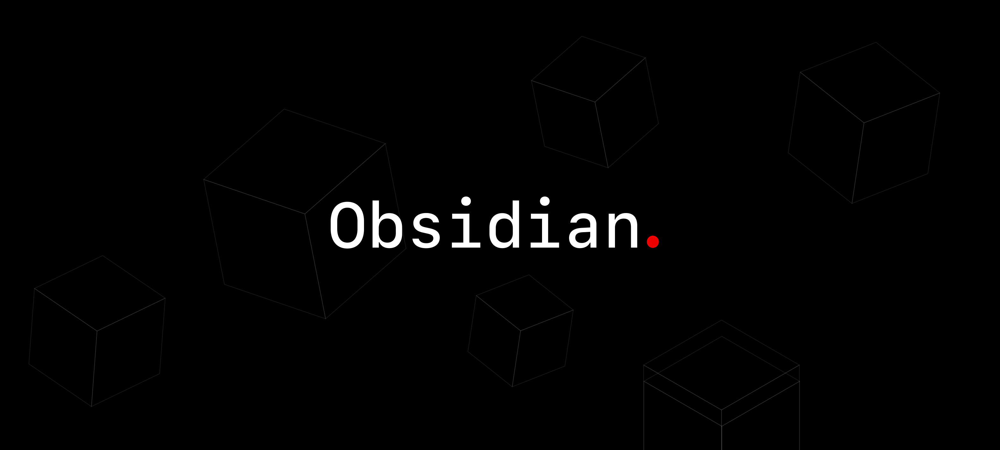

# Obsidian Next




**Obsidian Next** is a professional, structured, and secure AI agent interface for the terminal. Built by **Aurora Labs** (a division of the **Aurora Foundation**) with a "Structure-First" architecture for rigorous, interactive, and safe user experiences.

---

## Why Obsidian Next?

**Safer than "Whatever-Bot"**

Most AI coding assistants stream raw text and execute code blindly. Obsidian Next takes a different approach:

1.  **Structure Over Slop**: We don't stream raw Markdown. Agents emit **Typed JSON Events**, ensuring the UI is always in sync with the logic.
2.  **The Auditor**: A built-in security layer that pre-flights every tool call. It catches dangerous commands *before* they run.
3.  **Zero Hallucinated Ops**: Tools are strictly typed. If the Agent tries to call `deleteFile` (which doesn't exist), the system rejects it instantly.
4.  **Sandbox Runtime**: Supports OS-level isolation via `@anthropic-ai/sandbox-runtime`, with native fallbacks to `sandbox-exec` (macOS) and `firejail` (Linux).

## Workspace & Evaluation

The `workspace/` directory is a dedicated environment where **Polyoxy** is currently evaluating Obsidian Next.

- **Status**: Internal Evaluation / Pre-release.
- **Benchmarks**: Comprehensive safety and performance benchmarks are running. Results will be published soon.
- **Evaluation Goal**: The current workspace is used to stress-test the Auditor's ability to catch malicious patterns in a controlled environment.

## Security Features (v0.3.0)

Obsidian Next implements **Zero Trust AI Automation** with the following security layers:

### Implemented (v0.3.0-security)

1.  **Rotating Key System** [NEW]
    - Secure API key storage via macOS Keychain, Linux secret-tool, or encrypted file fallback
    - Machine-specific key derivation (AES-256-GCM)
    - Auto-rotation detection for long sessions
    - Never stores plaintext keys in config files

2.  **PII Redaction Engine** [NEW]
    - Real-time redaction of sensitive data before sending to LLM
    - 14 built-in patterns: email, phone, SSN, credit cards, AWS keys, API tokens, passwords, private keys, JWT
    - Configurable per-pattern enable/disable
    - Allowlist support for specific values

3.  **Audit Logging** [NEW]
    - Complete audit trail of all command executions
    - File operation logging (read/write/edit/delete)
    - Approval decision tracking
    - JSON format for easy parsing, auto-rotation at 10MB

4.  **Approval Enforcement** [FIXED]
    - Commands requiring approval now properly block execution
    - Safe mode enforces approval for all write operations
    - No bypass possible through mode switching

5.  **Sandbox Runtime**
    - OS-level isolation via `@anthropic-ai/sandbox-runtime`
    - Native fallbacks to `sandbox-exec` (macOS) and `firejail` (Linux)

### Roadmap

1.  **Hardware-Level Sandboxing**:
    - Integration with native OS hypervisors (Apple Virtualization Framework) for true VM isolation.
2.  **Signed Execution**:
    - Only allowing cryptographically signed tool definitions to run.
3.  **Network Isolation**:
    - Per-session network namespaces for complete network control.

## Documentation Directory

Fully detailed documentation is available in the **[docs/](docs/README.md)** directory:

- **[Architecture](docs/ARCHITECTURE.md)**: Supervisor-Agent Topology & Event Bus.
- **[Agent Logic](docs/AGENT_ARCHITECTURE.md)**: Planning, Modes, and Execution.
- **[Tools & Safety](docs/TOOLS.md)**: Reference for the 8 core tools and limits.
- **[Design System](docs/CLI_DESIGN_SYSTEM.md)**: Visual guide to the terminal UI.
- **[Sandboxing](docs/SANDBOX.md)**: Configuration for secure execution.

---

## Installation

### Primary Method (NPM)

**Latest development build direct from Aurora Labs.**
Recommended for quick evaluation only.

```bash
npm install -g @aurora-foundation/obsidian-next
```

Or run it instantly without installation using `npx`:

```bash
npx @aurora-foundation/obsidian-next
```

> [!IMPORTANT]
> **Privacy & Open Source Priority**
> We prioritize private, local execution and open-source security. For high-security environments, we strongly recommend the **Development Setup** (cloning and building locally) to ensure a 100% private, audited solution. The NPM installation is provided as an "easy setup" but is not the recommended path for production or sensitive deployments.

### Development Setup (From Source)

For contributors or those who want to run the latest development build:

```bash
# 1. Clone the repository
git clone https://github.com/auroradeveloperops/obsidian-next.git
cd obsidian-next

# 2. Install dependencies
npm install

# 3. Build
npm run build
```

### MCP Setup (Experimental)

Obsidian Next can be run as a Model Context Protocol (MCP) server.

1.  Copy the example config:
    ```bash
    cp mcp-config.example.json mcp-config.json
    ```
2.  Configure your client (e.g., Claude Desktop) to point to the server.

### Usage

```bash
# Set your API Key (or use /init to store securely)
export ANTHROPIC_API_KEY="sk-ant-..."

# Start the Agent
npm start
```

### Commands

| Command | Description |
|---------|-------------|
| `/settings` | Interactive settings menu (arrow keys + Enter) |
| `/mode` | Set execution mode (auto/plan/safe) |
| `/models` | Select AI model |
| `/status` | Show system status |
| `/cost` | Show session cost |
| `/undo` | Undo file changes |
| `/sandbox` | Toggle sandbox mode |
| `/clear` | Clear conversation |
| `/doctor` | Run diagnostics |
| `/exit` | Exit the CLI |

### Settings Menu

Access the interactive settings menu with `/settings`:

```
[*] Settings
> [1] Execution Mode          Current: safe
  [2] Security                PII redaction, audit logging
  [3] UI Preferences          Syntax highlighting, colors
  [4] Permissions             Allow/deny lists
  [5] Close Settings

Arrows: navigate | Enter: select/toggle | Esc: back
```

### Security Settings

| Setting | Default | Description |
|---------|---------|-------------|
| `security.piiRedaction` | `true` | Redact PII before sending to LLM |
| `security.auditLogging` | `true` | Log all commands to audit.log |
| `security.keyBackend` | `auto` | Key storage: auto/keychain/secret-tool/encrypted-file |

### Execution Modes

| Mode | Description |
|------|-------------|
| `safe` | (Default) Require approval for all write operations |
| `plan` | Read-only planning, approve plan before execution |
| `auto` | Execute all commands without confirmation |

## References & Standards

This project adheres to strict industry standards:

- **[Keep a Changelog](https://keepachangelog.com/)**: Standardized formatting for version history.
- **[Semantic Versioning](https://semver.org/)**: Predictable versioning.
- **[Model Context Protocol](https://modelcontextprotocol.io/)**: Open standard for AI context exchange.
- **[Anthropic Sandbox](https://github.com/anthropic-ai/sandbox-runtime)**: Secure runtime isolation.

## Contributing

We strictly enforce **Conventional Commits** and professional standards (no emojis in code).
See **[CONTRIBUTING.md](CONTRIBUTING.md)** for branch naming conventions (`username-feature/description`).

## Team

**Obsidian Next** is maintained by **Aurora Labs**, the applied research division of the **Aurora Foundation**. We focus on building the next generation of zero-trust AI infrastructure, including strictly typed agent topologies and secure cognitive architectures.

---

## License

Apache License 2.0 - See [LICENSE](LICENSE) for details.
