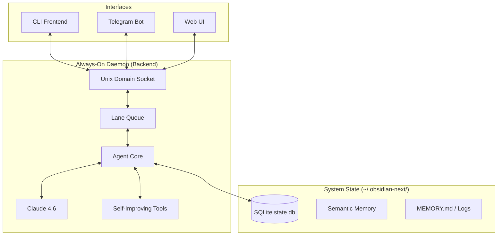

# Obsidian Next


> This README was written by Obsidian (v0.4.6) - a global, always-on autonomous engineering daemon with adaptive reasoning and system-wide persistent memory.

[](LICENSE)
[](package.json)
[](CHANGELOG.md)
[](docs/PRD.md)

**Obsidian Next** is a global, always-on autonomous engineering partner. It runs as a system-wide background service, managing multiple codebases and performing proactive engineering tasks while you're away.

Built for engineers who need an agent that lives in their system - not just in a terminal window.

---

## What Makes Obsidian Autonomous

| Feature | Obsidian Next | Other Assistants |
|---------|---------------|------------------|
| **Lifecycle** | Always-on Daemon (Service) | Script / Process-bound |
| **Reasoning** | Claude 4.6 Adaptive Thinking | Standard Chat |
| **Context** | 1 Million Token Mastery | 128k - 200k fixed |
| **Memory** | Semantic Vector Store (Hybrid) | Simple Chat History |
| **Proactivity** | Heartbeat Background Tasks | Reactive Only |
| **Scope** | Global (System-wide) | Project-locked |

---

## Quick Start

```bash
# Install globally
npm install -g @aurora-foundation/obsidian-next

# Initialize global daemon and services
obsidian init --service

# Check daemon status
obsidian status
```

---

## Core Capabilities

### Always-On Autonomy
Obsidian runs as a background service (`launchd` or `systemd`). It doesn't die when you close your terminal. It keeps reasoning, indexing, and auditing in the background.

### Claude 4.6 Adaptive Reasoning
Utilizing the latest **Thinking Blocks**, Obsidian modulates its reasoning effort based on task complexity. You can see its "Thinking Trace" in real-time before it acts.

### 1M Token Context window
Hold entire repositories in active memory. Obsidian uses **Prompt Caching** and **Context Distillation** to keep massive windows cheap, fast, and coherent.

### Proactive Heartbeat (The Scheduler)
Schedule background tasks to keep your systems healthy:
- **Nightly Audits**: Scan for security vulnerabilities or dead code.
- **Auto-Documentation**: Generate docstrings for new functions.
- **Health Checks**: Run tests and notify you via Telegram if they break.

```
/schedule "0 2 * * *" system:audit
/schedule "*/30 * * * *" system:sync_index
```

### Self-Improving Skills
Obsidian can autonomously expand its own toolbox. If it hits a capability gap, it writes, tests, and registers a new TypeScript tool in `~/.obsidian-next/skills/` without a restart.

---

## Commands

| Command | Description |
|---------|-------------|
| `/schedule` | Manage proactive background tasks |
| `/memory` | Export/sync the Semantic Knowledge Bank |
| `/workspace`| Focus the agent on a specific project root |
| `/pilot` | Secure GUI automation (Computer Use) |
| `/status` | Monitor daemon health and 1M context usage |
| `/resume` | Restore sessions from any workspace |

---

## Architecture (The Gateway Pattern)

Obsidian Next operates via a central backend service connected to multiple frontends:



---

## Security & Safety

- **Global Auditor**: Centralized security policy for all projects.
- **Lane Queue**: Prevents race conditions during concurrent access.
- **Visual Privacy Guard**: Redacts sensitive data from screenshots in Pilot Mode.
- **Kill Switch**: Immediate local or remote termination of all autonomous activity.

---

## Documentation

| Resource | Description |
|----------|-------------|
| [Master Plan](docs/MASTER_PLAN.md) | The Autonomous Roadmap |
| [Architecture](docs/ARCHITECTURE.md) | The Daemon & Gateway System |
| [Smart Context](docs/CONTEXT.md) | 1M Token & Semantic Memory |
| [Security Policy](docs/SECURITY.md) | Global Zero Trust Model |

---

## Development

```bash
npm run dev      # Watch mode
npm run build    # Build daemon and frontend
npm test         # Full suite (vitest)
```

---

## License

Copyright 2026 Aurora Foundation. Licensed under [Apache 2.0](LICENSE).
