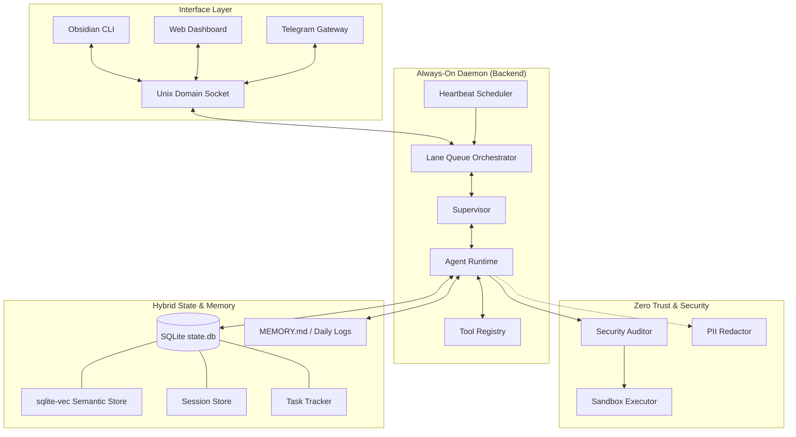

# Obsidian Next Architecture

## 1. Directory Structure (Global & System-Wide)

Obsidian Next has transitioned from a project-local bot to a global, system-wide autonomous daemon.

```
~/.obsidian-next/        # Global State Directory
├── state.db             # Central SQLite store (Sessions, Memos, Tasks, Usage)
├── settings.json        # Global user preferences and permissions
├── audit.log            # System-wide security audit trail
├── mcp.json             # MCP server configurations
├── MEMORY.md            # Human-readable long-term memory bank
├── logs/                # Daily Markdown logbooks (YYYY-MM-DD.md)
└── skills/              # Self-generated autonomous tools
```



## 2. Always-On Daemon
The system operates as a background service (via `launchd` or `systemd`).
- **Persistence**: The backend stays alive 24/7, maintaining context even when the terminal is closed.
- **Inter-Process Communication (IPC)**: Interfaces connect to the daemon via a Unix Domain Socket (`~/.obsidian-next/daemon.sock`).
- **Lane Queue**: Ensures serial execution of state-changing operations across multiple connected clients to prevent race conditions.

## 3. Event Driven Core
The system relies on a central `EventBus` (`src/core/bus.ts`) that decouples the backend from the frontend.
- **Agent** emits `thought`, `tool_start`, `tool_result`, `done`.
- **UI** listens and renders reactive components via the socket bridge.

## 4. Autonomous Skill System
The agent can autonomously expand its own capabilities:
- **`create_skill` Tool**: Allows the agent to write, test, and register new TypeScript tools in `~/.obsidian-next/skills/` without restarting the daemon.
- **Dynamic Registry**: Tools are loaded into the registry at runtime after passing sandboxed unit tests.

## 5. Security Architecture
- **Global Auditor**: Enforces boundaries relative to the active `workspaceRoot` rather than the CWD.
- **Sandboxing**: OS-level isolation via native fallbacks (`sandbox-exec` on macOS, `firejail` on Linux).
- **Permissions**: Global Allow/Deny patterns stored in `~/.obsidian-next/settings.json`.
- **Kill Switch**: Immediate termination of all OS-level control via signal handling or global hotkeys.

## 6. Hybrid Memory (Semantic + Relational)
- **SQLite (Relational)**: High-performance engine for logs, tasks, and state.
- **sqlite-vec (Semantic)**: Local vector search across past sessions and project files.
- **Markdown (Human-Readable)**: Bidirectional sync between the database and `MEMORY.md`. Manual edits to the file are indexed back into the agent's brain.

## 7. Session & Task Management
- **Workspaces**: Sessions are associated with specific directories but managed centrally.
- **Heartbeat**: Background scheduler performs proactive audits, health checks, and codebase indexing.
- **Restoration**: Full conversation history, including Claude 4.6 "Thinking Blocks," is preserved and restorable.
