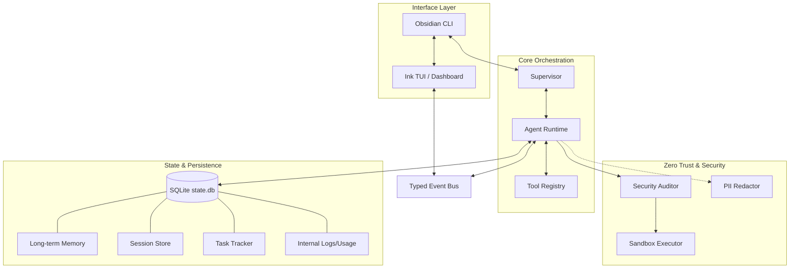

# Obsidian Next Architecture

## 1. Directory Structure

```
obsidian-next/
├── .agent/              # AI Rules & Skills
├── .obsidian/           # Runtime data (config, context, history, tasks)
├── docs/                # PRD, Design, Research
├── src/
│   ├── agents/          # High-level orchestrators (Supervisor)
│   ├── commands/        # Slash command handlers (/mode, /init, /resume, etc.)
│   ├── components/      # Ink UI Components (AgentLine, ToolOutput, SettingsMenu)
│   ├── core/            # Core System Logic
│   │   ├── agent.ts     # Main LLM execution loop
│   │   ├── auditor.ts   # Security & Permission checks
│   │   ├── bus.ts       # Typed EventBus
│   │   ├── commands.ts  # Command Registry
│   │   ├── config.ts    # Enforced Configuration (zod)
│   │   ├── context.ts   # Working Context Manager
│   │   ├── database.ts  # [NEW] SQLite Lifecycle Manager
│   │   ├── diff.ts      # Diff tracking & storage
│   │   ├── keyManager.ts # Secure API key storage
│   │   ├── llm.ts       # Anthropic SDK Wrapper
│   │   ├── memory.ts    # [NEW] Long-term Memory Manager
│   │   ├── migrations.ts # [NEW] SQLite Schema Migrations
│   │   ├── sandbox.ts   # Sandbox Executor (Runtime + Fallbacks)
│   │   ├── session.ts   # Session persistence & restore
│   │   ├── tasks.ts     # Task Tracker (Now DB backed)
│   │   ├── tools.ts     # Tool Registry & Implementations
│   │   ├── undo.ts      # Change tracking & Revert logic
│   │   └── usage.ts     # [NEW] Usage Tracking (Tokens/Cost)
│   ├── mcp/             # MCP Server Implementation
│   ├── ui/              # Main UI Components (Root, Dashboard)
│   └── index.ts         # Entry Point
├── tests/               # Vitest Suite
└── package.json
```



## 2. Event Driven Core
The system relies on a central `EventBus` (`src/core/bus.ts`) that decouples the UI from the logic.
- **Agent** emits `thought`, `tool_start`, `tool_result`, `done`.
- **UI** listens and renders reactive components (`Root.tsx`).

## 3. Tool System (8 Tools)
Implemented in `src/core/tools.ts`:
- `bash`: Shell execution (Audited & Sandboxed).
- `read`: File reading with line numbers.
- `write`: File creation (Undoable).
- `edit`: Search & Replace (Undoable).
- `list`: Directory listing.
- `grep`: Regex content search.
- `glob`: Pattern file search.
- `web_fetch`: URL content fetching (Safe-guarded).
- `memory`: Manage long-term session/user memory (store, recall, search).

## 4. MCP Integration
**Status**: Implemented (Experimental)
- Location: `src/mcp/`
- Exposes internal tools via Model Context Protocol.
- Can be run as a standalone server: `npm run mcp`.

## 5. Security Architecture
- **Auditor**: Pre-flight checks for all file/shell operations.
- **Sandboxing**: OS-level isolation via `@anthropic-ai/sandbox-runtime` or native fallbacks (`sandbox-exec` on macOS, `firejail` on Linux).
- **Permissions**: Granular Allow/Deny list stored in `.obsidian/settings.json`.
- **KeyManager**: Secure API key storage (Keychain/secret-tool/encrypted file).
- **PII Redactor**: Real-time sensitive data protection before LLM calls.
- **Audit Logging**: Complete trail of all operations in `.obsidian/audit.log`.

## 6. State Management (SQLite)
The system transitioned from markdown/JSON files to a centralized SQLite store (`.obsidian/state.db`):
- **Sessions**: Persistent history and metadata.
- **Memos**: Long-term "Handoff" context (preferences, facts, patterns).
- **Tasks**: Structured project tracking.
- **Usage**: Persistent token and cost tracking per session.

## 7. Session Lifecycle
Sessions enable persistent, resumable work:
- **Save**: `/exit` commits all in-memory state to SQLite.
- **Restore**: `/resume <id>` restores full session state from SQLite.
- **Diff Tracking**: File changes stored for review via `/diff`.
